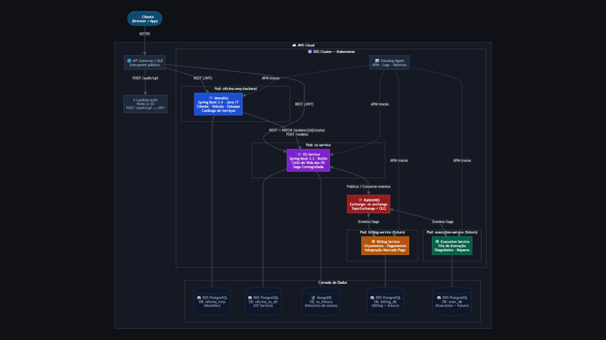
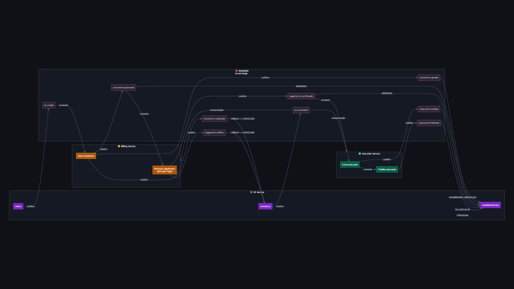
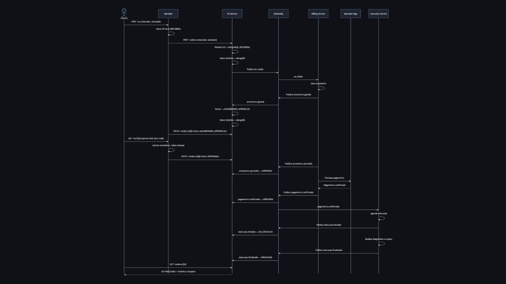
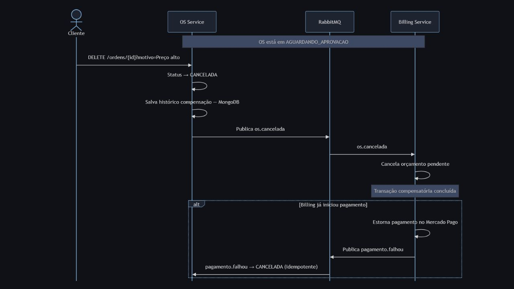
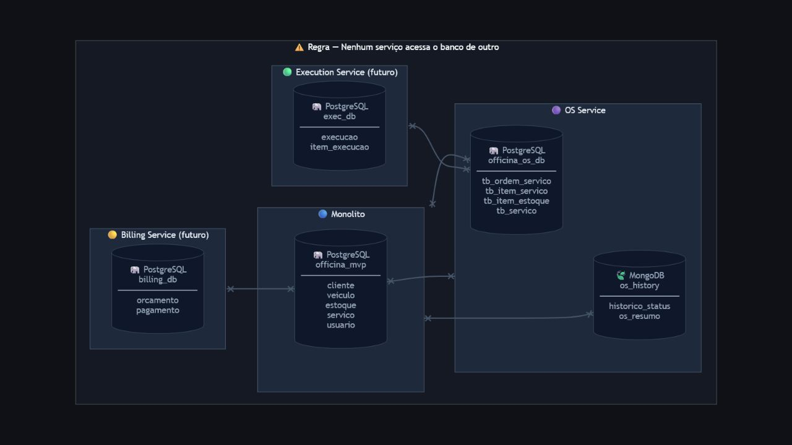

# Arquitetura de microsserviços

Os diagramas abaixo foram renderizados em **28/07/2026** a partir do arquivo
[`diagrama-arquitetura.html`](diagrama-arquitetura.html).

## Visão geral dos componentes e da infraestrutura

## Saga coreografada

## Sequência completa de uma Ordem de Serviço

## Rollback da Saga

## Isolamento dos bancos de dados

