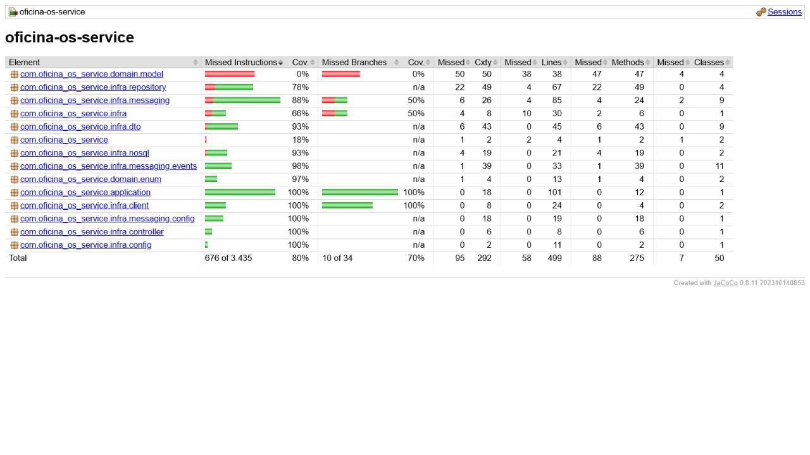

# Evidências de testes e cobertura

Evidência gerada em **28/07/2026** com o comando:

```bash
./gradlew check jacocoTestReport --no-daemon
```

## Resultado

| Verificação | Resultado |
|---|---:|
| Testes executados | 40 |
| Falhas | 0 |
| Erros | 0 |
| Testes ignorados | 0 |
| Cobertura JaCoCo por instruções | 80,32% |
| Cobertura JaCoCo por linhas | 88,38% |
| Cobertura JaCoCo por branches | 70,59% |
| Regra mínima do build | 80% |
| Build e verificação JaCoCo | Aprovados |
| Cobertura publicada no SonarCloud | 94,7% |
| Quality Gate do SonarCloud | Aprovado |

O percentual do SonarCloud é diferente do total bruto do JaCoCo porque a
análise remota aplica as exclusões de cobertura configuradas no
`build.gradle.kts`.

## Relatório JaCoCo



O relatório HTML completo é gerado localmente em:

```text
build/reports/jacoco/test/html/index.html
```

## Evidências externas

- [Projeto no SonarCloud](https://sonarcloud.io/summary/overall?id=rodriguessbarbara_oficina-os-service)
- [Badge público de cobertura](https://sonarcloud.io/api/project_badges/measure?project=rodriguessbarbara_oficina-os-service&metric=coverage)
- [Badge público do Quality Gate](https://sonarcloud.io/api/project_badges/measure?project=rodriguessbarbara_oficina-os-service&metric=alert_status)
- [Workflow de CI/CD e artefatos JaCoCo](https://github.com/rodriguessbarbara/oficina-os-service/actions/workflows/ci-cd.yaml)

O workflow publica o relatório `jacoco-report` como artefato de cada execução
do GitHub Actions, com retenção de sete dias.
